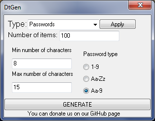
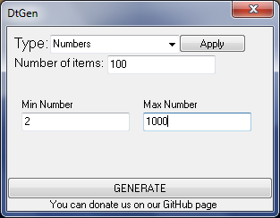
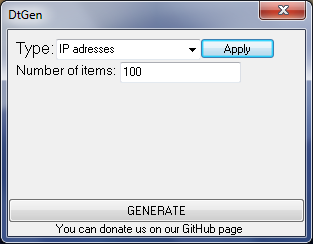

<h1>DtGen</h1>

This program is designed to generate different types of databases. Each generated database can be saved to a file with any extension.This is only the first version of the program and, therefore, there may be some problems in its work. In the future, the program will be improved.

<h3>Types of databases</h3>

1.Passwords

2.Numbers

3.IP-addresses

<h3>About</h3>

Platform: OS Windows

Version:0.0.1

<h3>Bugs and warnings</h3>

If the program does not respond (most likely due to large values), do not close it as it continues to generate the base and after a while it will generate it.

<h3>Screenshots</h3>

